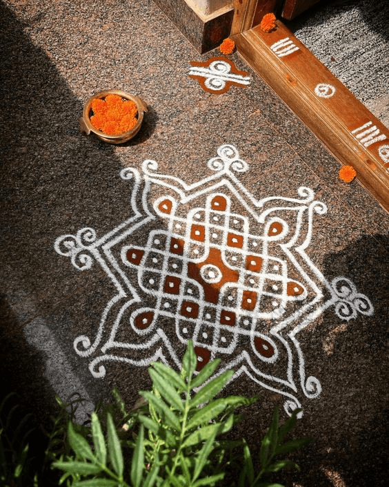
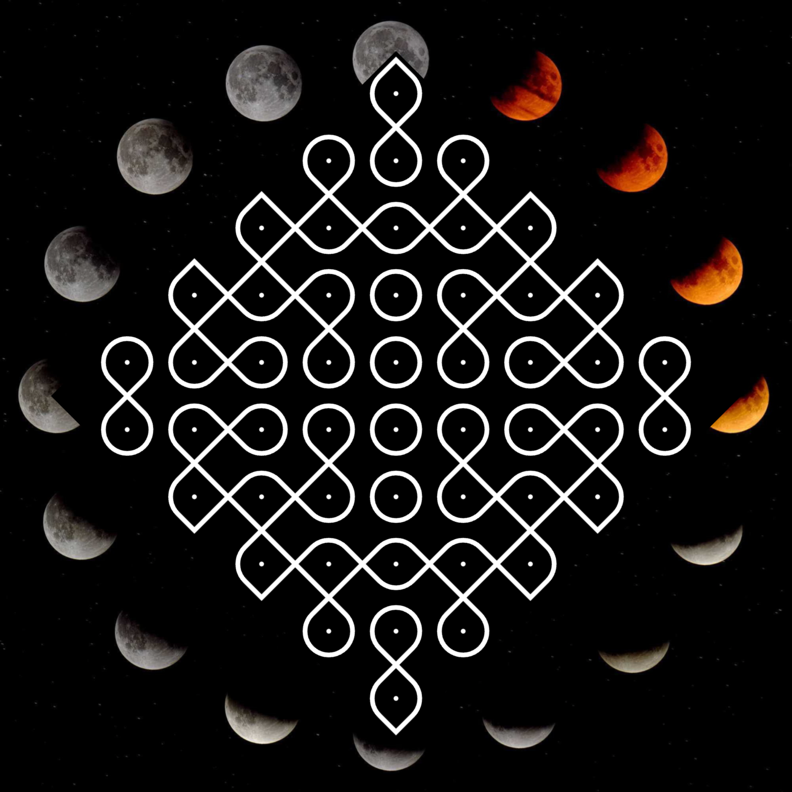
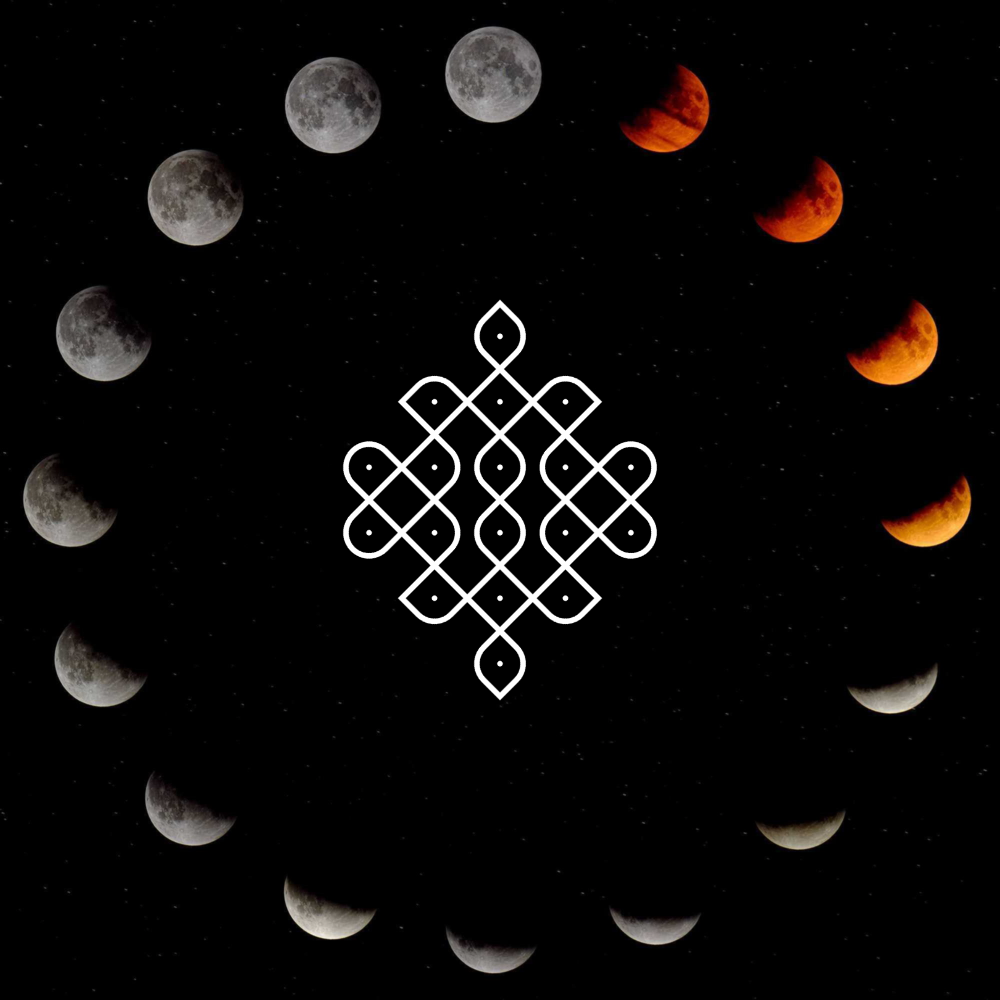

# 🌸 Kolam Pattern Game

[Kolam.fun](https://kolam.fun) is a browser-based interactive art toy inspired by the ancient South Indian tradition of **Kolam** — a sacred geometric pattern drawn daily with rice flour to invite harmony, beauty, and the blessings of goddess Lakshmi. This project translates that ephemeral morning ritual into a dynamic **digital experience** where user movement subtly shapes and evolves each Kolam design.



## ✨ What is Kolam?

Kolam is a traditional Tamil art form where women draw symmetrical line patterns around a grid of dots on the ground, often using rice flour. These transient designs are spiritual offerings as well as aesthetic expressions. Rooted in **geometry**, **ritual**, and **daily mindfulness**, Kolam patterns embody both mathematical elegance and devotional practice.

Read more about the cultural context in [`kolam.md`](./kolam.md).

---

## 🕹️ How the Game Works

This game captures the **essence of Kolam creation** while introducing interactive logic:

- 💠 You click anywhere on the canvas.
- 📈 Your **movement speed and timing** influence how densely the Kolam pattern connects.
- 🌕 Background visuals are overlaid with a yantra image, evoking spiritual symbolism.
- 🔁 The complexity increases automatically as your pattern becomes more fluid.
- 💾 You can **save your Kolam** with one click.

Under the hood, the game computes a `movementValue` based on:
```js
movementValue = time-weighted ratio of distance / time
```
This value influences `limit`, a probability threshold that controls how the lines grow between grid points — leading to a **natural evolution** of pattern density, like breath influencing meditation.

---

## 🧠 Cultural Meets Computational

### Mathematical Rules (Inspired by Traditional Kolam):
- Number of **crossings** is always `pullis - 1`.
- Number of **edges** is `2 × crossings`.
- All dots (pullis) are surrounded by lines with **symmetrical logic**.
- The system hints at Eulerian structures and graph theory concepts — with **interactive user behavior** affecting path probability.
- The design evolution follows a philosophical rhythm: **mindful movement begets fascination**.

---

## 🛠️ How to Use

Open [Kolam.fun](https://kolam.fun) and explore how pattern changes depending on where you click or tap. You can tap anywhere, try to see the force of effects. Hint: the toy best reacts to taps then you are relaxed but focused, like watching falling stars on the night sky.

Click the **"Save Kolam"** button to download your current design as a `.png` image you can share.

---

## 📁 File Structure

- `sketch.js` – Main logic for drawing, user interaction, and probabilistic path generation.
- `kolam.md` – Full cultural and anthropological background of Kolam.
- `index.html` – Canvas container and controls.
- `img/luna2.jpg` – Background image.

---

## 🔮 Future Ideas

- 🎨 Pattern exports as SVG for digital printing.
- 📊 Graph analysis (Eulerian/Hamiltonian path checks).
- 🌐 Shareable Kolam "signatures" as compressed movement seeds.
- 🧘 Integration with breath sensors or meditation timers.

---

## 🙏 Credits and Info

- Inspired by the daily ritual of **Kolam drawing women** across Tamil Nadu and beyond
- Algorithmic movement logic developed using [p5.js](https://p5js.org/)
- J5.js implementation from Processing Sketch by [Bárbara Almeida](https://www.openprocessing.org/sketch/296103/)
- Cultural research from essay in [GEA Magazine](https://www.academia.edu/68390117/Kolam_%C4%8Carobnost_ri%C5%BEevih_vzorcev)

---

## 📷 Screenshots

> "Kolam represents both the beauty of order and the order of beauty."





---

## 📚 Learn More

- [Kolam patterns in mathematics](https://en.wikipedia.org/wiki/Kolam)
- [p5.js creative coding library](https://p5js.org/)
- [Gift Siromoney on Kolam topology](https://www.cmi.ac.in/gift/Kolam.htm)


